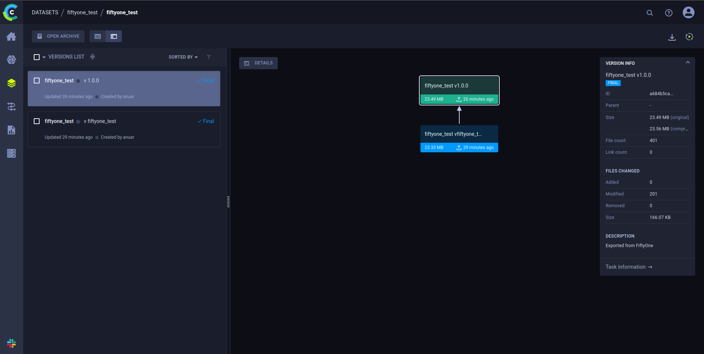

Collection of plugins to integrate FiftyOne and ClearML

| Plugin | Name | Desc | Has additional requirements |
| - | - | - | - |
| Clearml Export | clearml-export | Export from FiftyOne and create new datasets and dataset versions in ClearML | + |
| Dataset Splitter | dataset-splitter | Attach split tags (e.g. train,val) to images based on image hash. Tags can be used during export to ClearML (currently only YOLOv5 dataset format) | |
| Zip extractor | zip-extractor | Extract images from zip to host machine to import images in FiftyOne (currently with poor optimization) | |

## Plugin installation

### 1. Download plugin

```shell
fiftyone plugins download \
    https://github.com/HitogamiAG/fiftyone-plugins \
    --plugin-names HitogamiAG/clearml-export
```

### 2. Install the requirements

```shell
fiftyone plugins requirements HitogamiAG/clearml-export --install
```

### 3. Set environemtn variables

See `.env_example`

### 4. Initialize ClearML on this machine

In CLI: `clearml-init` and follow instructions